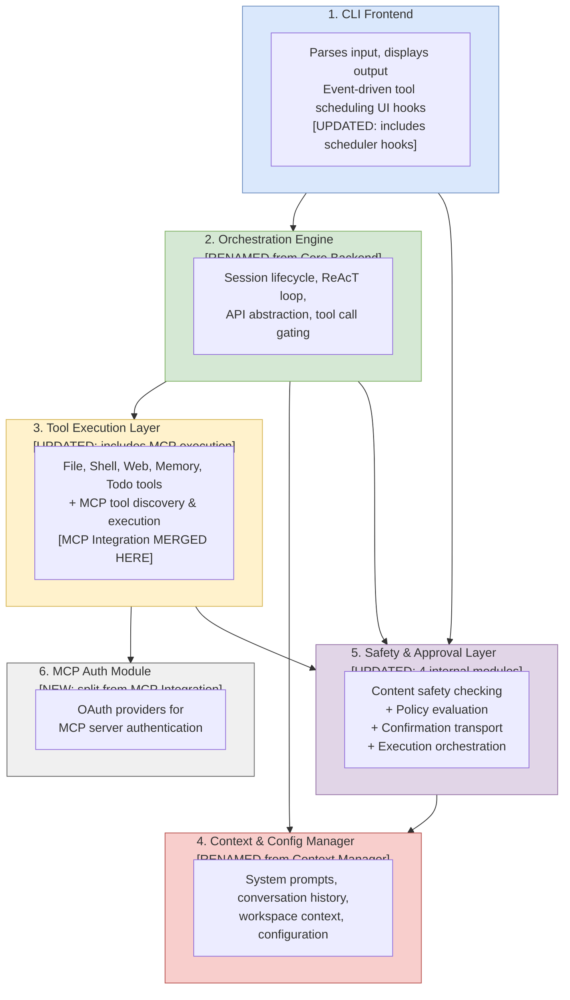

# A2 Architecture Diagrams — Gemini CLI
## Group 5: It Compiles (Sometimes)

> These diagrams are based on direct source code analysis of the Gemini CLI codebase
> (`packages/cli/src/` and `packages/core/src/`). All dependencies confirmed from import statements.
> Use these as the basis for your drawn box-and-arrow diagrams. Copy into draw.io or Lucidchart.

---

## Diagram 1 — High-Level Concrete Architecture

*Use this for the "Concrete Architecture" section of the report.*
*Every arrow confirmed from code imports and function calls.*

```mermaid
graph TD
    subgraph CLIFrontend["Subsystem 1 — CLI Frontend\npackages/cli/src/"]
        CMD[commands/]
        UI[ui/hooks/ — useGeminiStream\nuseToolExecutionScheduler]
        SVCL[services/ | config/ | utils/]
    end

    subgraph OrchestrEng["Subsystem 2 — Orchestration Engine\npackages/core/src/core/"]
        GC[GeminiClient\nclient.ts]
        GCHAT[GeminiChat\ngeminiChat.ts]
        TURN[Turn\nturn.ts]
        CG[ContentGenerator ⟨interface⟩\ncontentGenerator.ts]
        CTS[CoreToolScheduler\ncoreToolScheduler.ts]
        PRM[getCoreSystemPrompt\nprompts.ts]
    end

    subgraph ToolExec["Subsystem 3 — Tool Execution Layer\npackages/core/src/tools/"]
        FT[File Tools\nread-file.ts, write-file.ts\nedit.ts, glob.ts, ls.ts]
        ST[Shell Tool\nshell.ts]
        WT[Web Tools\nweb-fetch.ts, web-search.ts]
        MT[Memory & Todo\nmemoryTool.ts, write-todos.ts]
        TR[ToolRegistry\ntool-registry.ts]
        MCP_T[MCP Execution ⚠️\nmcp-client.ts\nmcp-client-manager.ts\nmcp-tool.ts]
    end

    subgraph CtxCfg["Subsystem 4 — Context & Config Manager\npackages/core/src/config/ + resources/\n+ core/prompts.ts"]
        CFG[Config class]
        RES[resources/]
        PMTS[prompts/]
    end

    subgraph SafetyLayer["Subsystem 5 — Safety & Approval Layer\nsafety/ + policy/ + confirmation-bus/ + scheduler/"]
        SAFETY[Safety Checkers\nsafety/checker-runner.ts\nsafety/built-in.ts]
        PE[PolicyEngine\npolicy/policy-engine.ts]
        MB[MessageBus\nconfirmation-bus/message-bus.ts]
        SCHED[Scheduler + ToolExecutor\nscheduler/scheduler.ts\nscheduler/tool-executor.ts]
    end

    subgraph MCPAuth["Subsystem 6 — MCP Auth Module\npackages/core/src/mcp/"]
        OAUTH[OAuth Providers\nauth-provider.ts\ngoogle-auth-provider.ts\noauth-provider.ts]
    end

    %% Dependencies (all confirmed from code)
    CLIFrontend -->|"GeminiClient.sendMessageStream()"| OrchestrEng
    CLIFrontend -->|"MessageBus events for\nUI confirmation"| SafetyLayer

    OrchestrEng -->|"ToolRegistry.getFunctionDeclarations()\nToolExecutor.execute()"| ToolExec
    OrchestrEng -->|"getCoreSystemPrompt(config)\nConfig.getToolRegistry()"| CtxCfg
    OrchestrEng -->|"PolicyEngine.checkPolicy()\nMessageBus.publish()"| SafetyLayer

    ToolExec -->|"OAuth auth for\nMCP connections"| MCPAuth
    ToolExec -->|"PolicyDecision check\nbefore execution"| SafetyLayer

    SafetyLayer -->|"ApprovalMode + shell allowlist\nfrom Config"| CtxCfg

    %% Legend styling
    style CLIFrontend fill:#dae8fc,stroke:#6c8ebf
    style OrchestrEng fill:#d5e8d4,stroke:#82b366
    style ToolExec fill:#fff2cc,stroke:#d6b656
    style CtxCfg fill:#f8cecc,stroke:#b85450
    style SafetyLayer fill:#e1d5e7,stroke:#9673a6
    style MCPAuth fill:#f0f0f0,stroke:#666666
```

---

## Diagram 2 — Updated Conceptual Architecture

*Use this for the "Updated Conceptual Architecture" section.*
*Shows how A1's 6 subsystems are updated based on concrete analysis.*
*Key change: MCP Integration is absorbed into Tool Execution Layer at the concrete level.*



---

## Diagram 3 — Orchestration Engine Internal (Subsystem Deep Dive)

*Use this for the "Subsystem Deep Dive — Concrete Architecture Breakdown" section.*

```mermaid
graph TD
    subgraph OE["Orchestration Engine — packages/core/src/core/"]
        subgraph SM["Subcomponent 1 — Session Manager\nclient.ts → GeminiClient"]
            SM1["startChat(extraHistory?, resumedSessionData?)"]
            SM2["resetChat()"]
            SM3["tryCompressChat()"]
            SM4["updateSystemInstruction()"]
            SM5["generateJson()"]
        end

        subgraph TE["Subcomponent 2 — Turn Executor\nturn.ts → Turn"]
            TE1["run() — ReAcT loop entry point"]
            TE2["Processes GeminiEventType events:\nContent, ToolCallRequest,\nToolCallResponse, Finished"]
        end

        subgraph AA["Subcomponent 3 — API Abstraction\ncontentGenerator.ts → ContentGenerator ⟨interface⟩"]
            AA1["generateContent(request, userPromptId)"]
            AA2["generateContentStream(request, userPromptId)"]
            AA3["countTokens(request)"]
            AA4["Implementations: LoggingContentGenerator\nFakeContentGenerator\nRecordingContentGenerator"]
        end

        subgraph TEG["Subcomponent 4 — Tool Execution Gate\ncoreToolScheduler.ts → CoreToolScheduler"]
            TEG1["Manages ToolCall state machine:\nValidating→Scheduled→Executing→Complete"]
            TEG2["Delegates to ToolExecutor\n(scheduler/tool-executor.ts)"]
            TEG3["Routes via MessageBus\nfor UI confirmation"]
        end

        GC2[GeminiChat\ngeminiChat.ts\nsendMessageStream()]
    end

    SM -->|"new GeminiChat()"| GC2
    SM -->|"new Turn(chat, scheduler)"| TE
    TE -->|"GeminiChat.sendMessageStream()"| GC2
    TE -->|"scheduleToolCalls()"| TEG
    TEG -->|"ToolExecutor.execute()"| TOOL_EXT["Tool Execution Layer\n(external)"]
    AA -->|"implemented by"| GC2
    SM -->|"getCoreSystemPrompt(config)"| CTX_EXT["Context & Config Manager\n(external)"]
    TEG -->|"PolicyEngine.checkPolicy()"| SAFE_EXT["Safety & Approval Layer\n(external)"]

    style SM fill:#d5e8d4,stroke:#82b366
    style TE fill:#dae8fc,stroke:#6c8ebf
    style AA fill:#fff2cc,stroke:#d6b656
    style TEG fill:#e1d5e7,stroke:#9673a6
```

---

## Diagram 4 — Reflexion Analysis Table (Copy into Report)

*Both of these divergences must be in the Reflexion Analysis section.*

### High-Level Reflexion

| Relation | In A1 Conceptual? | In Concrete? | Type | Git Evidence | Interpretation |
|---|---|---|---|---|---|
| MCP Integration as standalone subsystem | Yes (Subsystem 4) | **No** | **Divergence** | Commit `b288f124`: `tools/mcp-client.ts` has always been in `tools/` | Developers integrated MCP as a tool type rather than an isolated subsystem, prioritizing simplicity of tool discovery pipeline |
| MCP auth as part of MCP Integration | Yes | Partially — `mcp/` folder only handles OAuth | **Divergence** | Commit `41e01c23`: "resolve PKCE length issue" — pure OAuth concern | `mcp/` folder is functionally an auth module, not an integration module |
| Safety/Approval as single subsystem | Yes (Subsystem 6) | **No — 4 modules**: `safety/`, `policy/`, `confirmation-bus/`, `scheduler/` | **Divergence** | Commit `e2901f3f` (Jan 19, 2026): "decouple scheduler into orchestration, policy, confirmation" — explicit refactor | Safety concerns grew complex enough to justify decomposition; each module has clear responsibility |
| Tool scheduling in CLI Frontend | No | **Yes** — `useToolExecutionScheduler.ts` in `packages/cli/src/ui/hooks/` | **Divergence** | Commit `525539fc` (Jan 21, 2026): "implement event-driven tool execution scheduler" in CLI layer | React event-driven UI required scheduling coordination at the UI layer — cross-cutting concern not anticipated at conceptual level |
| CLI Frontend → Core Backend dependency | Yes | Yes — `useGeminiStream` → `GeminiClient.sendMessageStream()` | **Convergence** | — | Clean boundary maintained |
| Tool Execution Layer in `packages/core/src/tools/` | Yes | Yes — all tool groups confirmed | **Convergence** | — | Structure matches A1 |
| Core Backend as central orchestrator | Yes | Yes — `GeminiClient` is entry point, drives Turn → GeminiChat | **Convergence** | — | |
| Safety gates tool execution | Yes | Yes — `CoreToolScheduler → PolicyEngine → ToolExecutor` | **Convergence** | — | |

### Subsystem-Level Reflexion (Orchestration Engine)

| Relation | In Conceptual? | In Concrete? | Type | Evidence | Interpretation |
|---|---|---|---|---|---|
| Session Manager manages chat state | Yes | Yes — `GeminiClient.startChat()`, `resetChat()`, `tryCompressChat()` | Convergence | `client.ts` lines 250-320 | Exact match |
| Turn Executor drives ReAcT loop | Yes | Yes — `Turn.run()` processes `GeminiEventType` events | Convergence | `turn.ts` | Exact match |
| API Abstraction as interface | Yes (component) | Yes — but stronger: `ContentGenerator` is a Strategy pattern with 3+ implementations | **Convergence (stronger)** | `contentGenerator.ts` interface + `LoggingContentGenerator`, `RecordingContentGenerator`, `FakeContentGenerator` | More sophisticated than conceptualized — full Strategy pattern |
| Tool Execution Gate serializes calls | Yes | Yes — no parallel execution, state machine in `coreToolScheduler.ts` | Convergence | `coreToolScheduler.ts` + `scheduler/types.ts` ToolCall state machine | Exact match |
| Tool Execution Gate executes tools directly | Yes (implied) | **No** — delegates to `ToolExecutor` in `scheduler/tool-executor.ts` | **Divergence** | Commit `e2901f3f`: ToolExecutor extracted to `scheduler/` module | Execution was decoupled from the gate for testability and separation of concerns |

---

## How to Use These Diagrams

1. **Copy the Mermaid code** into [mermaid.live](https://mermaid.live) to preview it rendered
2. **Screenshot the rendered diagram** — this becomes your redrawn architecture diagram
3. **Add a proper legend box** to each screenshot before putting in the report
4. **Make sure fonts are readable** — zoom in if needed, export at high resolution
5. **Name boxes identically** to how they appear in every section of your report text
